# k8s-observability-opentelemetry
End-to-end Kubernetes observability with OpenTelemetry, Prometheus, Grafana, Jaeger, and EFK using a Python FastAPI application on Kind.

--- 

Create a Kind kubernetes cluster

kind create cluster --name opentelemetry --config .\k8s\clusters.yaml

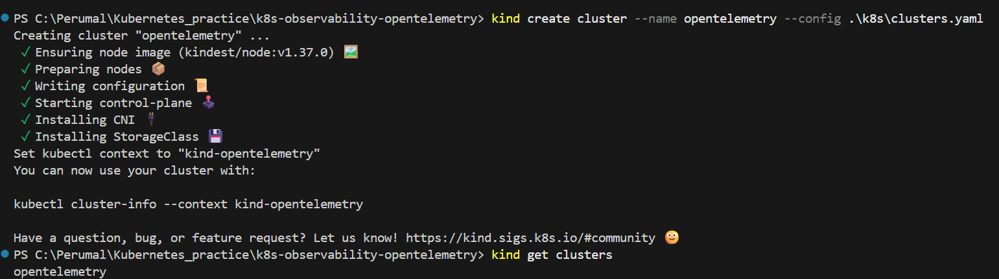

create a secret.yaml with the below DB password with the filename k8s/secret.yaml

apiVersion: v1
kind: Secret
metadata:
  name: opsdesk-secret
  namespace: opsdesk
type: Opaque
stringData:
  DATABASE_PASSWORD: "<Your DB password>"
  POSTGRES_PASSWORD: "<Your DB password>"

kubectl apply -f ./k8s/namespace.yaml
kubectl apply -f ./k8s/configmap.yaml
kubectl apply -f ./k8s/postgres-init-configmap.yaml
kubectl apply -f ./k8s/secret.yaml
kubectl apply -f ./k8s/postgres.yaml

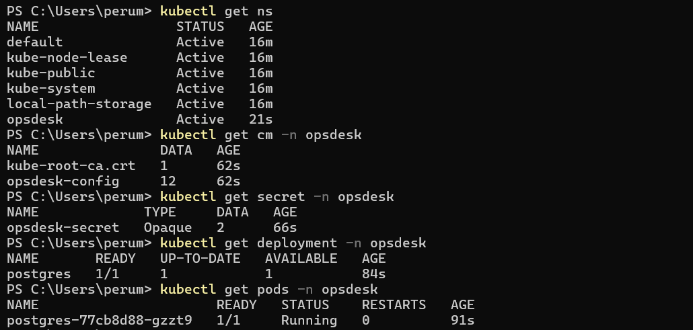

Load the docker images into Kind cluster. Just before this build the images for frontend and backend using the dockerfile under opsdesk source reposiotry, with the below naming conventions:

kind load docker-image opsdesk/frontend:0.1 --name opentelemetry
kind load docker-image opsdesk/backend:0.1 --name opentelemetry

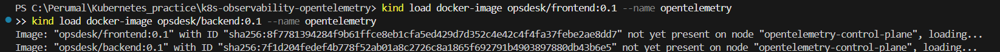

kubectl apply -f ./k8s/backend.yaml
kubectl apply -f ./k8s/frontend.yaml

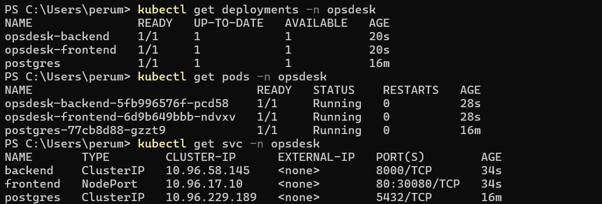

Since we exposed our frontend as nodeport, we can access the application using localhost

http://localhost:30080/

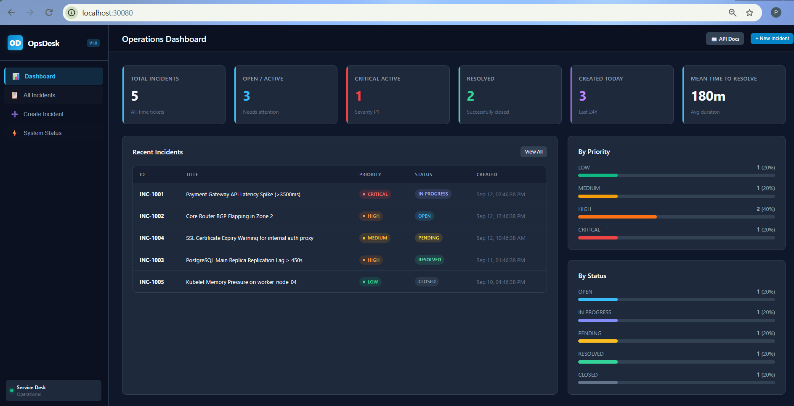

------------------------------------------------------------------

OPENTELEMETRY:

------------------------------------------------------------------

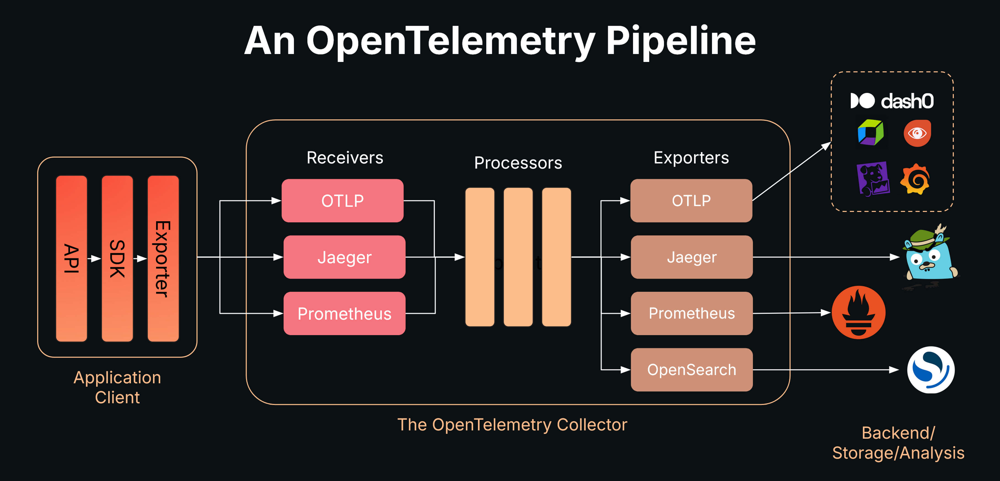

kubectl apply -f observability/namespace.yaml

Refer the official site for opentelemtry setup: https://opentelemetry.io/docs/platforms/kubernetes/helm/

helm repo add open-telemetry https://open-telemetry.github.io/opentelemetry-helm-charts

helm repo update

helm repo list

Check the available OpenTelemetry charts
helm search repo open-telemetry

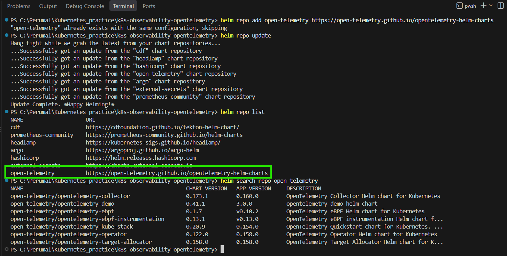

Before installing the helm chart, we can verify the configurable values of that chart

helm show values open-telemetry/opentelemetry-operator --version 0.122.0

The output will be fairly long. Instead we can search for what we wants like this

helm show values open-telemetry/opentelemetry-operator --version 0.122.0 |
    Select-String "manager:" -Context 0,10

helm show values open-telemetry/opentelemetry-operator --version 0.122.0 |
    Select-String "self" -Context 3,5

helm show values open-telemetry/opentelemetry-operator --version 0.122.0 |
    Select-String "webhook" -Context 3,5

Then we can create an exact values.yaml for our project

--------------------------------------------------
Note: 
--------------------------------------------------

1. What did we search?

We checked the Helm chart's default configuration using:

helm show values open-telemetry/opentelemetry-operator --version 0.122.0

Then we searched specifically for:

Select-String "self"
Select-String "webhook"

Why?

To understand how the chart handles TLS certificates and admission webhooks before installing it.

2. What did we find?

The chart provides 3 certificate options:

cert-manager
Helm auto-generated certificate
User-provided certificate

We chose Option 2 — Helm auto-generated certificate.

3. What are we configuring?

In our values.yaml:

admissionWebhooks:
  create: true
  servicePort: 443
  failurePolicy: Fail

  certManager:
    enabled: false

  autoGenerateCert:
    enabled: true
    recreate: true
    certPeriodDays: 365

crds:
  create: true

Why?

We don't need to install an additional cert-manager just for the Operator.

Helm will generate and manage the Operator's self-signed webhook certificate.

Important: In Helm chart version 0.122.0, certManager and autoGenerateCert are configured under admissionWebhooks.

4. Admission Webhook
admissionWebhooks:
  create: true
  servicePort: 443
  failurePolicy: Fail

Why?

The OpenTelemetry Operator uses the admission webhook for tasks such as automatic instrumentation/injection into application pods.

5. CRDs
crds:
  create: true

Why?

The Operator needs Kubernetes Custom Resource Definitions such as:

Instrumentation
OpenTelemetryCollector

So Helm installs the required CRDs.

--------------------------------------------------------------------------

Install the operator:

helm upgrade --install opentelemetry-operator `
  open-telemetry/opentelemetry-operator `
  --namespace observability `
  --version 0.122.0 `
  --values observability/opentelemetry/values.yaml

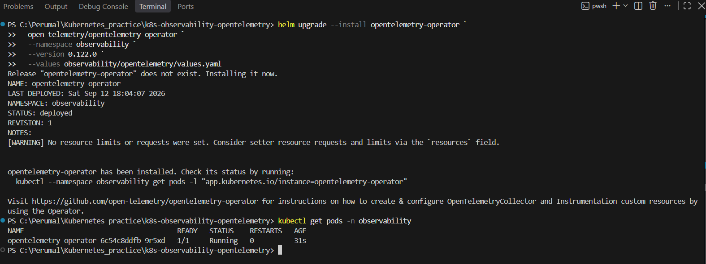

Opentelemetry Collector chart installation:

helm upgrade --install opentelemetry-collector `
  open-telemetry/opentelemetry-collector `
  --namespace observability `
  --version 0.173.1 `
  --values observability/opentelemetry/collector-values.yaml

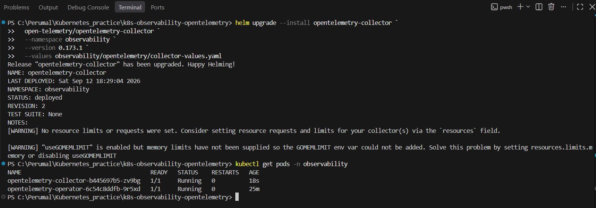

So far opentelemtry setup completed architecute:

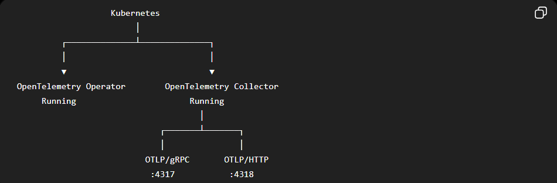

-------------------------

Add the Jaeger Helm repository

helm repo add jaegertracing https://jaegertracing.github.io/helm-charts
helm repo update
helm search repo jaegertracing

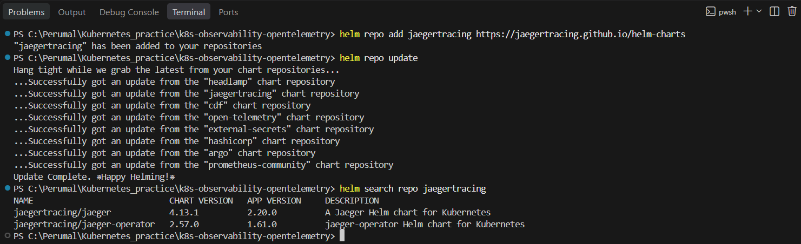

For our project, we should use jaegertracing/jaeger, not the Jaeger Operator. We already have the OpenTelemetry Operator installed. Its job is to handle OpenTelemetry resources and automatic instrumentation.

Install Jeaeger:

helm upgrade --install jaeger `
  jaegertracing/jaeger `
  --namespace observability `
  --version 4.13.1 `
  --values observability/opentelemetry/jaeger-values.yaml

verify 
kubectl get pods -n observability
kubectl get svc -n observability

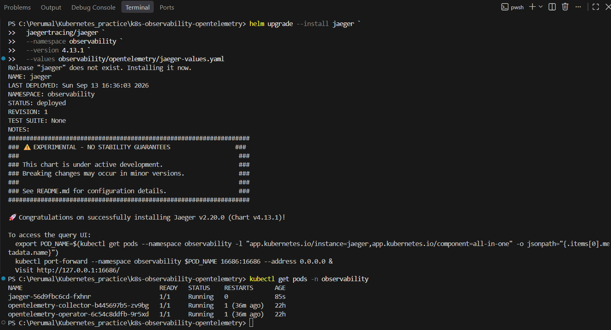

Next: verify the Jaeger UI

Port forward
kubectl port-forward svc/jaeger 16686:16686 -n observability
http://localhost:16686

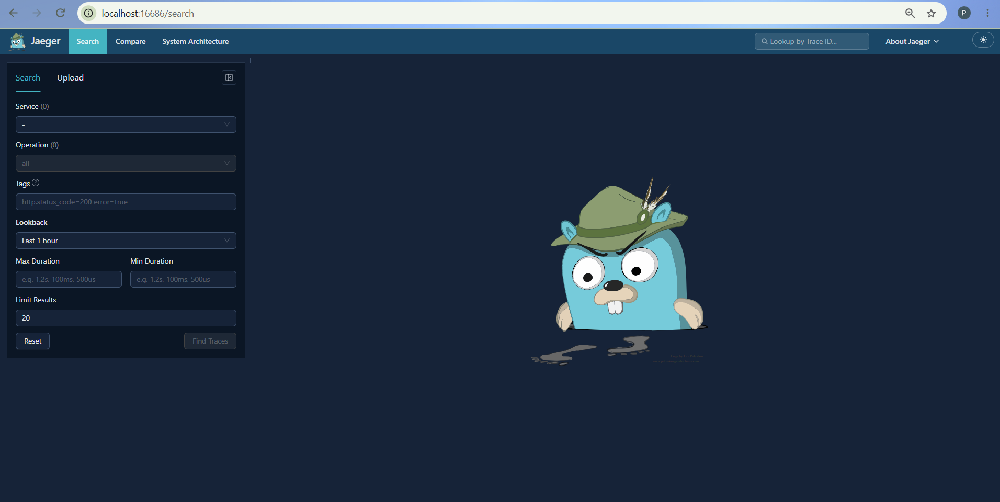

Next: Collector → Jaeger

We want to change the Collector's exporter from: debug to: Jaeger

Since the Collector and Jaeger are in the same Kubernetes namespace (observability), the Collector can reach Jaeger using:

jaeger:4317

Update collector-values.yaml from

Change this:

exporters:
  debug: {}

to:

exporters:
  otlp:
    endpoint: jaeger:4317
    tls:
      insecure: true

And change the traces pipeline from:

exporters:
  - debug

to:

exporters:
  - otlp

Why tls.insecure: true?

This is only for our local Kubernetes environment.
------

Then upgrade the Collector

helm upgrade --install opentelemetry-collector `
  open-telemetry/opentelemetry-collector `
  --namespace observability `
  --version 0.173.1 `
  --values observability/opentelemetry/collector-values.yaml

Verify:

kubectl get pods -n observability

---

Now we are going to auto instrument our backend deployment:

Python auto-instrumentation through the OpenTelemetry Operator. We won't modify the FastAPI source or rebuild the existing image.

we are going to create a insturmentation resource on the same namespace as our backend application.  This is the Yaml file location

k8s/observability/opentelemetry/instrumentation.yaml

where we'll explicitly point the instrumentation to opentelemetry collector service:

http://opentelemetry-collector.observability.svc.cluster.local:4318

Then apply it 

kubectl apply -f ./observability/opentelemetry/instrumentation.yaml
kubectl get instrumentation -n opsdesk

on the opsdesk-backend deployment, lets add instrumentation annotation

instrumentation.opentelemetry.io/inject-python: "opsdesk/opsdesk-python-instrumentation"

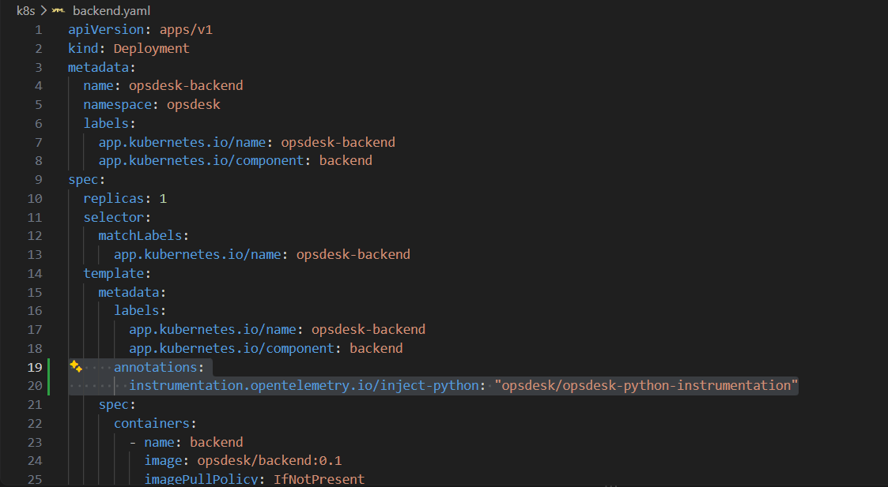

kubectl apply -f k8s/backend.yaml

verify and note for init container section:

kubectl describe pod -n opsdesk -l app.kubernetes.io/name=opsdesk-backend

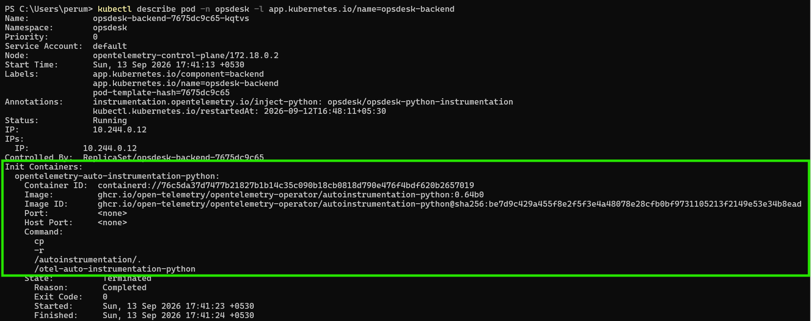

Jaeger UI verification: you can see the opsdesk backend got listed in the UI

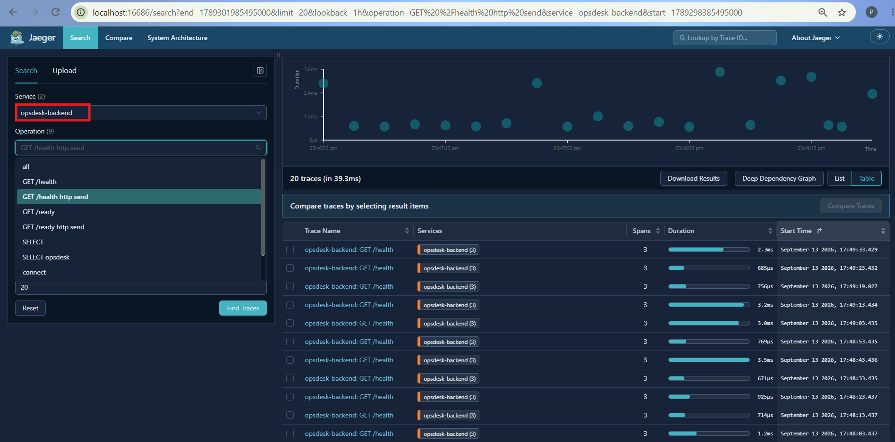

---

Metrcis Observability - Prometheus:

helm search repo prometheus-community/kube-prometheus-stack
helm show values prometheus-community/kube-prometheus-stack