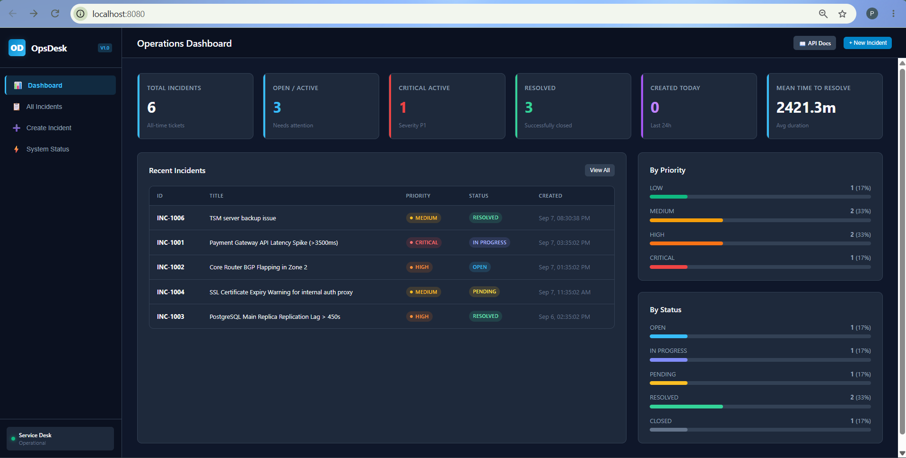
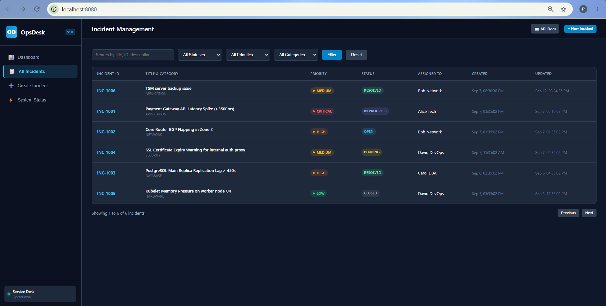
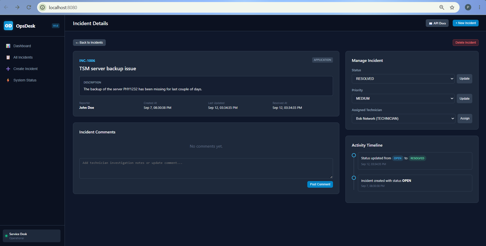
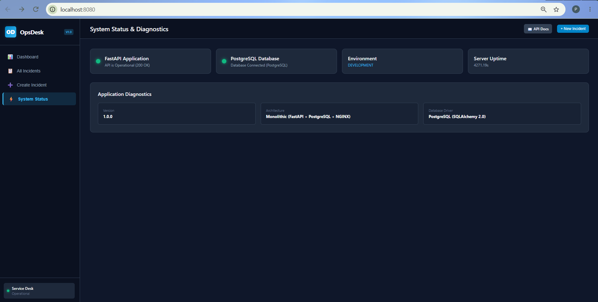

# OpsDesk — IT Incident Management System

**OpsDesk** is a clean, modern, and production-style **IT Incident Management System** designed for tracking operational incidents, assigning tickets to technicians, tracking incident histories, and managing system service health.

---

## Table of Contents

1. [Architecture](#architecture)

2. [Technology Stack](#technology-stack)

3. [Project Directory Structure](#project-directory-structure)

4. [Features & UI Pages](#features--ui-pages)

5. [Local Development](#local-development)

6. [Docker Compose Deployment](#docker-compose-deployment)

---

## 1. Architecture

OpsDesk uses a clean, lightweight monolithic architecture:

```text
       Browser (Web Client)

                │

                ▼

        [ NGINX Frontend ] (Port 80 / 8080)

          (Proxies /api/* -> Backend)

                │

                ▼

        [ FastAPI Backend ] (Port 8000)

                │

                ▼

        [ PostgreSQL Database ] (Port 5432)
```

* **Frontend Container**: NGINX serving a Vanilla JavaScript SPA (HTML5, CSS3, modern dark theme).
* **Backend Container**: Python 3.12 + FastAPI + SQLAlchemy 2.0 + Pydantic v2.
* **Database Container**: PostgreSQL 16 with connection pooling and schema seeding.

---

## 2. Technology Stack

* **Backend**: Python 3.12+, FastAPI, SQLAlchemy 2.0, Pydantic v2, Uvicorn.

* **Database**: PostgreSQL 16.

* **Frontend**: HTML5, CSS3 (Modern Slate Dark Theme), Vanilla JavaScript (Modular ES6), NGINX.

* **Containerization & Orchestration**: Docker, Docker Compose, Kubernetes manifests.

---

## 3. Project Directory Structure

```text
opsdesk/

├── backend/

│   ├── app/

│   │   ├── api/                      # REST route controllers
│   │   │   ├── incidents.py          # Incident CRUD, filters, assignments
│   │   │   ├── users.py              # User directory
│   │   │   ├── comments.py           # Incident comments & timeline history
│   │   │   ├── dashboard.py          # KPI summary & stats aggregation
│   │   │   └── health.py             # /health, /ready, /api/system/info
│   │   ├── database/
│   │   │   ├── connection.py         # SQLAlchemy engine & session pool
│   │   │   └── init_db.py            # Table initialization & seed data
│   │   ├── models/                   # SQLAlchemy ORM models
│   │   │   ├── base.py
│   │   │   ├── user.py               # User roles (REPORTER, TECHNICIAN, MANAGER)
│   │   │   ├── incident.py           # Incident & IncidentHistory
│   │   │   └── comment.py            # Incident comment threads
│   │   ├── schemas/                  # Pydantic data validation schemas
│   │   ├── services/                 # Business logic services
│   │   │   ├── incident_service.py   # Incident management & audit history
│   │   │   ├── dashboard_service.py # KPI aggregations & MTTR calculation
│   │   │   └── background_service.py # Periodic background statistics aggregator
│   │   ├── config.py                 # Environment configuration
│   │   ├── logging_config.py         # Standard structured application logging
│   │   └── main.py                   # FastAPI lifespan & application init
│   ├── requirements.txt
│   └── Dockerfile
│
├── frontend/
│   ├── src/
│   │   ├── css/styles.css            # Responsive IT Operations theme
│   │   ├── js/                       # View controllers & REST client
│   │   │   ├── api.js
│   │   │   ├── app.js
│   │   │   ├── dashboard.js
│   │   │   ├── incidents.js
│   │   │   ├── incident-detail.js
│   │   │   ├── create-incident.js
│   │   │   └── health.js
│   │   └── index.html                # SPA Interface
│   ├── nginx.conf                    # NGINX reverse proxy configuration
│   └── Dockerfile
│
├── docker-compose.yml                # Local multi-container development
├── .env.example
├── .gitignore
└── README.md
```

---

## 4. Features & UI Pages

### 1. **Operations Dashboard**

* Total incidents, Open / In-Progress incidents, Critical (P1) incidents, Resolved incidents, Tickets created today.
* Mean Time To Resolve (MTTR).
* Priority and Status distribution progress bars.
* Recent incidents quick table.



---

### 2. **Incident Management**

* Filter by status (`OPEN`, `IN_PROGRESS`, `PENDING`, `RESOLVED`, `CLOSED`).
* Filter by priority (`LOW`, `MEDIUM`, `HIGH`, `CRITICAL`).
* Filter by category (`APPLICATION`, `DATABASE`, `NETWORK`, `SECURITY`, `HARDWARE`, `OTHER`).
* Real-time search by title, description, or Incident ID.
* Pagination controls.



---

### 3. **Create Incident**

* Form with input validation.
* Category, priority, reporter, and technician selection.


---

### 4. **Incident Details & History**

* Quick status, priority, and technician re-assignment buttons.
* Technician comments thread.
* Chronological audit timeline (status changes, re-assignments, creations).
* Delete ticket action.



---

### 5. **System Status & Diagnostics**

* Application API status, PostgreSQL database connectivity, server uptime, environment info, and runtime metadata.



---

## 5. Local Development

### Prerequisites

* Python 3.12+

* PostgreSQL or Docker

### 1. Backend Setup

```bash
cd opsdesk/backend

# Create virtual environment
python -m venv .venv

source .venv/bin/activate  # On Windows: .venv\Scripts\activate

# Install dependencies
pip install -r requirements.txt

# Run backend
uvicorn app.main:app --reload --port 8000
```

API Documentation will be available at http://localhost:8000/docs.

### 2. Frontend Setup

You can serve `frontend/src/` with any static server (e.g. `npx serve frontend/src` or Python `python -m http.server 3000 --directory frontend/src`).

---

## 6. Docker Compose Deployment

Start all containers (PostgreSQL, Backend, Frontend) with a single command:

```bash
cd opsdesk

docker compose up --build
```

### Accessing Services

* **OpsDesk Web UI**: http://localhost:8080

* **FastAPI OpenAPI Swagger**: http://localhost:8080/docs

* **FastAPI Direct Backend**: http://localhost:8000

* **PostgreSQL**: `localhost:5432` (`user: opsdesk`, `password: opsdesk_secret_password`, `db: opsdesk`)

To shut down:

```bash
docker compose down -v
```
